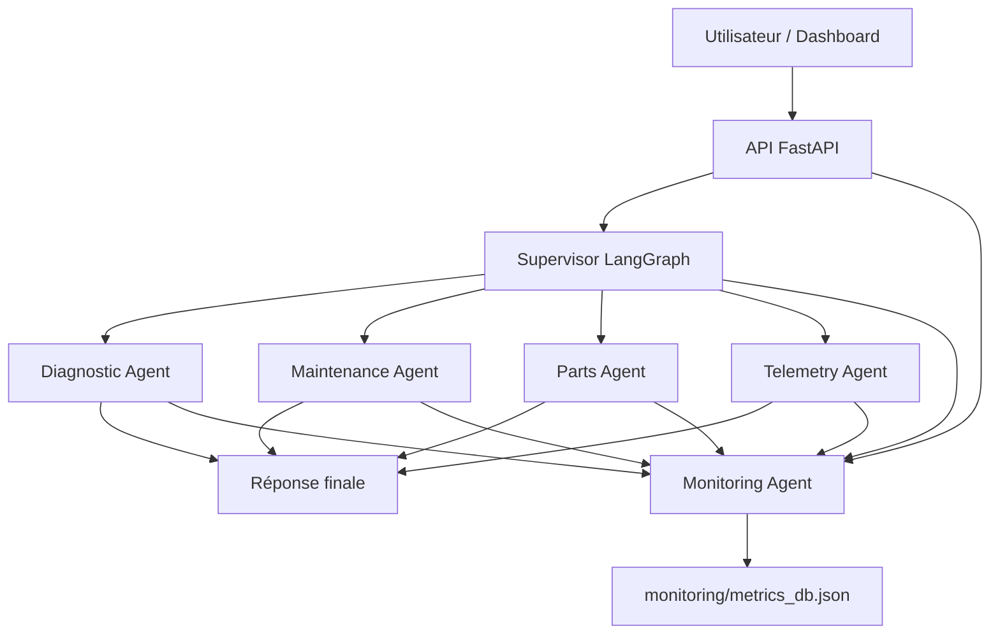

# Runbook - Automotive Multi-Agent System

Date: 2026-06-26

## 1. Vue d'ensemble

Automotive Multi-Agent System est une application automobile en français basée sur une architecture multi-agents. Le système reçoit une question utilisateur, ajoute un contexte véhicule, puis un superviseur route la demande vers un agent spécialisé.

Composants principaux:

| Composant | Rôle |
|---|---|
| API FastAPI | Expose les endpoints de requête, sessions et métriques |
| Supervisor | Analyse l'intention et choisit l'agent métier |
| Diagnostic Agent | Codes OBD, pannes, symptômes moteur |
| Maintenance Agent | Entretien, vidange, révision, planning |
| Parts Agent | Pièces détachées, références, compatibilité, prix indicatifs |
| Telemetry Agent | Températures, capteurs, consommation, performance |
| Monitoring Agent | Logs JSON, correlation ID, métriques persistées |
| Dashboard React/Vite | Console de test, historique et vues de performance |

## 2. Architecture fonctionnelle



Le flux nominal est:

1. L'utilisateur envoie une question.
2. L'API crée ou reçoit un contexte véhicule.
3. Un `correlation_id` UUID v4 est généré pour tracer toute la session.
4. Le superviseur choisit une route: `diagnostic`, `maintenance`, `parts`, `telemetry` ou `FINISH`.
5. L'agent choisi produit une réponse en français.
6. La session est journalisée dans `monitoring/metrics_db.json`.

## 3. Prérequis

Backend:

- Python 3.11 recommandé.
- Accès à une clé `GROQ_API_KEY`.
- Dépendances Python du fichier `requirements.txt`:
  - `pytest`
  - `langgraph`
  - `langchain-core`
  - `langchain-groq`
  - `langsmith`
  - `python-dotenv`
  - `fastapi`
  - `uvicorn`

Frontend:

- Node.js et npm.
- Dashboard Vite/React dans le dossier `dashboard`.

Sécurité:

- Le zip fourni contient une clé API dans `.env`. Ne pas la partager, ne pas la committer, et la faire tourner si elle a déjà été exposée.

## 4. Variables d'environnement

Créer un fichier `.env` à la racine du projet:

```bash
GROQ_API_KEY=<votre_cle_groq>
```

Ne pas placer de secret dans le runbook, les tickets, les logs ou le dépôt Git.

## 5. Installation backend

Depuis la racine du projet `project_26_JUN`:

```bash
python3.11 -m venv .venv
source .venv/bin/activate
pip install --upgrade pip
pip install -r requirements.txt
```

Vérifier que le fichier `.env` existe et contient `GROQ_API_KEY`.

## 6. Démarrage backend

Mode démonstration en ligne de commande:

```bash
python main.py
```

Mode API:

```bash
uvicorn api:app --host 0.0.0.0 --port 8000 --reload
```

Contrôle rapide:

```bash
curl http://localhost:8000/
```

Réponse attendue:

```json
{"status":"running"}
```

## 7. Démarrage dashboard

Dans le dossier `dashboard`:

```bash
npm install
npm run dev
```

Le dashboard attend le backend sur:

```text
http://localhost:8000
```

Fonctions disponibles:

| Onglet | Usage |
|---|---|
| Console de Test | Envoyer une question avec contexte véhicule |
| Performances | Voir métriques globales, latence moyenne, distribution agents |
| Historique | Rechercher les sessions par correlation ID, agent ou texte |

## 8. Endpoints API

### Santé API

```http
GET /
```

Retourne:

```json
{"status":"running"}
```

### Envoyer une question

```http
POST /query
Content-Type: application/json
```

Exemple:

```json
{
  "question": "J'ai un code OBD P0300 et mon moteur vibre au ralenti",
  "vehicle_context": {
    "marque": "Renault",
    "modele": "Clio IV",
    "annee": 2019,
    "kilometrage": 85000,
    "motorisation": "1.5 dCi 90ch"
  }
}
```

Réponse attendue:

```json
{
  "correlation_id": "uuid-v4",
  "response": "réponse de l'agent",
  "agent_history": ["supervisor→diagnostic", "diagnostic:done"]
}
```

### Lister les sessions

```http
GET /sessions
```

Retourne les sessions triées de la plus récente à la plus ancienne.

### Détail d'une session

```http
GET /sessions/{correlation_id}
```

Retourne les événements, agents invoqués, question, réponse et timestamps.

### Métriques globales

```http
GET /metrics
```

Retourne:

- `total_queries`
- `average_latency_ms`
- `agent_distribution`
- `average_agent_latencies`

## 9. Exploitation quotidienne

### Vérification rapide de service

1. Vérifier que l'API répond sur `GET /`.
2. Envoyer une question simple sur `POST /query`.
3. Vérifier que la réponse contient un `correlation_id`.
4. Vérifier que `GET /sessions/{correlation_id}` retourne les événements.
5. Vérifier que le dashboard affiche l'API comme en ligne.

### Requêtes de test recommandées

Diagnostic:

```text
J'ai un code OBD P0300 et mon moteur vibre au ralenti
```

Maintenance:

```text
À quel kilométrage dois-je faire la prochaine vidange ?
```

Pièces:

```text
Quelle référence pour les plaquettes de frein avant ?
```

Télémétrie:

```text
Température moteur de 115°C et liquide de refroidissement bas
```

## 10. Observabilité

Chaque événement est loggé en JSON avec:

| Champ | Description |
|---|---|
| `timestamp` | Date UTC ISO |
| `correlation_id` | Identifiant unique de session |
| `agent` | Agent ou composant émetteur |
| `event` | Événement applicatif |
| `level` | Niveau de log |
| `extra` | Informations complémentaires optionnelles |

Fichier de persistance:

```text
monitoring/metrics_db.json
```

Événements importants:

| Événement | Signification |
|---|---|
| `session_start` | Début d'une requête utilisateur |
| `routing_decision` | Le superviseur démarre la décision de routage |
| `routed_to=<agent>` | Agent choisi par le superviseur |
| `start` | Début d'exécution d'un agent métier |
| `end` | Fin d'exécution d'un agent métier |
| `session_end` | Réponse finale enregistrée |

## 11. Tests

Lancer la suite:

```bash
python -m pytest
```

Les tests couvrent:

- génération et propagation du correlation ID;
- structure minimale des logs;
- agents spécialisés;
- routage superviseur;
- endpoints `/`, `/sessions`, `/sessions/{id}`, `/metrics`;
- persistance et récupération de sessions.

CI GitHub Actions:

- Python 3.11;
- installation via `pip install -r requirements.txt`;
- exécution `python -m pytest`.

## 12. Déploiement Docker

Le `Dockerfile` existant:

```dockerfile
FROM python:3.11-slim
WORKDIR /app
COPY . .
RUN pip install --no-cache-dir -r requirements.txt
CMD ["python", "main.py"]
```

Build:

```bash
docker build -t automotive-mas .
```

Exécution du mode CLI:

```bash
docker run --rm --env-file .env automotive-mas
```

Pour exposer l'API en conteneur, modifier la commande au lancement:

```bash
docker run --rm --env-file .env -p 8000:8000 automotive-mas \
  uvicorn api:app --host 0.0.0.0 --port 8000
```

## 13. Incidents et dépannage

### API hors ligne dans le dashboard

Symptômes:

- indicateur rouge `API Serveur Hors ligne`;
- erreurs côté console de test.

Actions:

1. Démarrer le backend avec `uvicorn api:app --reload`.
2. Tester `curl http://localhost:8000/`.
3. Vérifier que le port utilisé est bien `8000`.
4. Vérifier les erreurs Python dans le terminal backend.

### Erreur 500 sur `/query`

Causes probables:

- `GROQ_API_KEY` absente ou invalide;
- problème réseau vers Groq;
- dépendance Python manquante;
- réponse LLM inattendue.

Actions:

1. Vérifier `.env`.
2. Redémarrer le backend après modification de `.env`.
3. Relancer une requête simple.
4. Inspecter les logs JSON avec le `correlation_id` si disponible.

### Aucune session dans `/sessions`

Causes probables:

- aucune requête `/query` exécutée;
- fichier `monitoring/metrics_db.json` absent;
- permissions d'écriture insuffisantes;
- exécution depuis un mauvais répertoire.

Actions:

1. Envoyer une requête `/query`.
2. Vérifier l'existence de `monitoring/metrics_db.json`.
3. Lancer l'application depuis la racine du projet.

### Le routage renvoie `FINISH`

Causes probables:

- intention utilisateur ambiguë;
- le superviseur reçoit une réponse hors liste;
- LLM indisponible ou réponse non conforme.

Actions:

1. Reformuler la question avec un mot-clé explicite: code OBD, vidange, pièce, température, capteur.
2. Vérifier l'historique d'agents dans la réponse.
3. Contrôler les logs `routing_decision` et `routed_to=...`.

### Tests qui modifient les métriques locales

Les tests utilisent le monitoring et peuvent écrire dans `monitoring/metrics_db.json`.

Actions:

1. Sauvegarder le fichier de métriques avant tests si nécessaire.
2. Utiliser une base temporaire pour les tests lors d'une future amélioration.
3. Ne pas interpréter les métriques de test comme trafic réel.

## 14. Sécurité et conformité

Points à appliquer avant mise en production:

1. Faire tourner toute clé API exposée dans un zip, un dépôt ou un ticket.
2. Ajouter `.env` à `.gitignore` si ce n'est pas déjà fait.
3. Remplacer `allow_origins=["*"]` par les domaines autorisés du frontend.
4. Éviter de stocker des données personnelles véhicule/utilisateur sans consentement.
5. Ajouter authentification et limitation de débit sur l'API.
6. Journaliser les erreurs sans inclure de secrets.
7. Sauvegarder ou purger `monitoring/metrics_db.json` selon la politique de rétention.

## 15. Checklist de mise en production

- [ ] `GROQ_API_KEY` créée dans un gestionnaire de secrets.
- [ ] Ancienne clé exposée révoquée.
- [ ] CORS restreint au domaine du dashboard.
- [ ] API lancée avec un serveur de production adapté.
- [ ] Healthcheck configuré sur `GET /`.
- [ ] Logs collectés dans une plateforme externe si nécessaire.
- [ ] Sauvegarde ou rotation du fichier de métriques configurée.
- [ ] Tests `python -m pytest` passés.
- [ ] Dashboard buildé avec `npm run build`.
- [ ] Procédure d'incident partagée à l'équipe.

## 16. Commandes utiles

Backend:

```bash
source .venv/bin/activate
uvicorn api:app --host 0.0.0.0 --port 8000 --reload
python -m pytest
```

Dashboard:

```bash
cd dashboard
npm install
npm run dev
npm run build
```

API:

```bash
curl http://localhost:8000/
curl http://localhost:8000/metrics
curl http://localhost:8000/sessions
```

## 17. Contacts et ownership

À compléter par l'équipe:

| Sujet | Responsable | Contact |
|---|---|---|
| Backend/API | À compléter | À compléter |
| Agents IA | À compléter | À compléter |
| Dashboard | À compléter | À compléter |
| Exploitation | À compléter | À compléter |
| Sécurité secrets | À compléter | À compléter |

